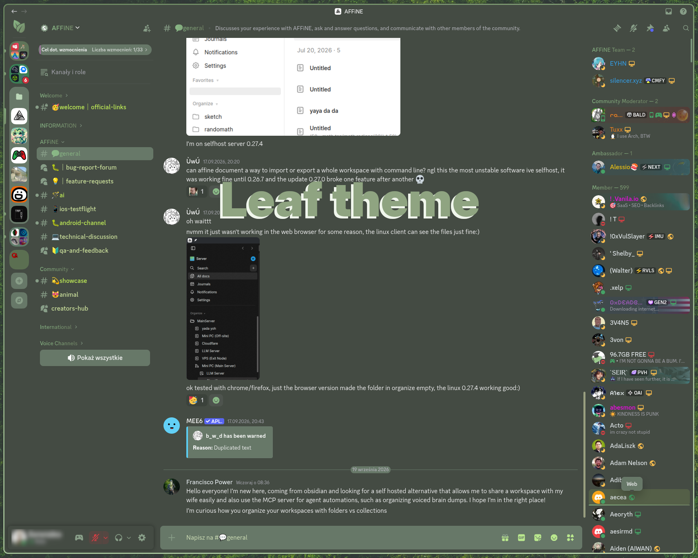

# 🍃 Leaf
 
A green theme for Vesktop (works on Vencord and BetterDiscord too). Swaps Discord's default grey for green tones, with gradients on headers and channel names. The whole interface is covered, including Discord's new layout and Vencord's own panels.
 

 
## Contents
 
```
Leaf-theme/
├── img/              # status icons + Discord loading gif
├── leaf.png          # replacement Discord icon
└── Leaf.theme.css    # the theme
```
 
## Palette
 
| Variable | Value | Used for |
|---|---|---|
| `--mainColor` | `#889e88` | accents, icons, active elements |
| `--gradientColor01` | `#708364` | darker gradient stop |
| `--gradientColor02` | `#8ab987` | lighter gradient stop |
| `--backgroundColor01` | `#677868` | panels, cards, popouts |
| `--backgroundColor02` | `#444b43` | main background |
| `--linkcolor` | `#c4f08a` | links |
| `--backgroundCode` | `#79977d` | code blocks, scrollbars |
| `--buttons` | `#b9e88d` | button icons |
 
Everything lives in `:root` at the top of the file — swapping a few hex values is enough for your own variant.
 
## Installation
 
**Vesktop — online** (updates itself):
Settings → Vencord → Themes → Online Themes, then paste:
```
https://raw.githubusercontent.com/misss13/Leaf/refs/heads/main/leaf_theme.css
```

## ¡BONUS!
This is too bizarre to PAY for PNG in 2026. Yeah others won't see it, but YOU WILL that's what counts. **Getting your USER-ID:** Settings → Advanced → Developer Mode → right-click your avatar in a conversation → **Copy User ID**

Next add below section in custom CSS.

```
.member__5d473:has(img[src*="/avatars/USER-ID/"]) .childContainer__91a9d {
    position: relative;
    overflow: hidden;
    border-radius: 6px;
    isolation: isolate;
}

.member__5d473:has(img[src*="/avatars/USER-ID/"]) .childContainer__91a9d::before {
    content: "";
    position: absolute;
    inset: 0;
    z-index: -1;
    pointer-events: none;
    background-image: url("https://cdn.discordapp.com/media/v1/collectibles-shop/1495807265175900180/static"); /*Or any png from discord shop*/
    background-size: cover;
    background-position: right center;
    background-repeat: no-repeat;
    /* miękkie wygaszenie po lewej, tak jak robi to Discord */
    -webkit-mask-image: linear-gradient(to right, transparent 0%, rgba(0,0,0,.35) 45%, #000 85%);
    mask-image: linear-gradient(to right, transparent 0%, rgba(0,0,0,.35) 45%, #000 85%);
}
```
